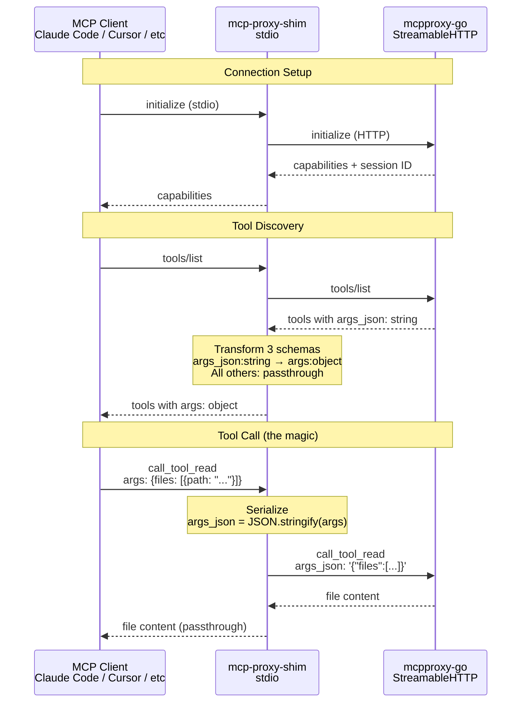
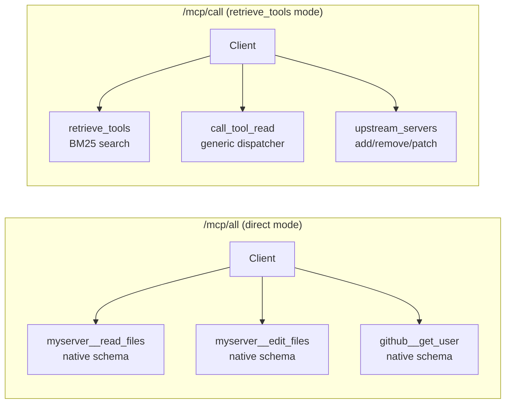

# @luutuankiet/mcp-proxy-shim

**Stdio MCP shim for [mcpproxy-go](https://github.com/smart-mcp-proxy/mcpproxy-go)** — eliminates `args_json` string escaping overhead for LLM clients.

## The Problem

mcpproxy-go's `/mcp/call` mode uses **generic dispatcher tools** (`call_tool_read`, `call_tool_write`, `call_tool_destructive`) that accept arguments as `args_json: string` — a pre-serialized JSON string. This is a sound design choice (one schema covers any upstream tool), but it creates real pain for LLM consumers:

### Before (what the LLM must produce)

```json
{
  "name": "call_tool_read",
  "arguments": {
    "name": "myserver:read_files",
    "args_json": "{\"files\":[{\"path\":\"src/index.ts\",\"head\":20}]}"
  }
}
```

The LLM must escape every quote, every nested object, every bracket. For complex tool calls (file edits with match_text containing code), this becomes:

```json
"args_json": "{\"files\":[{\"path\":\"src/app.ts\",\"edits\":[{\"match_text\":\"function hello() {\\n  return \\\"world\\\";\\n}\",\"new_string\":\"function hello() {\\n  return \\\"universe\\\";\\n}\"}]}]}"
```

This is **~400 tokens of overhead per call**, and LLMs frequently produce malformed payloads (mismatched escaping, missing backslashes).

### After (with the shim)

```json
{
  "name": "call_tool_read",
  "arguments": {
    "name": "myserver:read_files",
    "args": {
      "files": [{"path": "src/index.ts", "head": 20}]
    }
  }
}
```

Native JSON. No escaping. ~50 tokens. Zero malformed payloads.

### Impact at Scale

| Metric | Without shim | With shim | Savings |
|--------|-------------|-----------|---------|
| Tokens per call | ~400 | ~50 | **87%** |
| 30-call session overhead | ~12,000 tokens | ~1,500 tokens | **10,500 tokens saved** |
| Escaping bugs | Frequent | Zero | — |
| Edit operations (worst case) | ~500 tokens | ~200 tokens | **60%** |

## How It Works



### What Gets Transformed

Only 3 tools are transformed. **Everything else passes through unchanged:**

| Tool | Schema change | All other fields |
|------|--------------|-----------------|
| `call_tool_read` | `args_json: string` → `args: object` | Unchanged |
| `call_tool_write` | `args_json: string` → `args: object` | Unchanged |
| `call_tool_destructive` | `args_json: string` → `args: object` | Unchanged |
| `retrieve_tools` | — | Passthrough |
| `upstream_servers` | — | Passthrough |
| `code_execution` | — | Passthrough |
| `read_cache` | — | Passthrough |
| All others | — | Passthrough |

## Quick Start

Add to your `.mcp.json` — no install needed, `npx` fetches on first run:

```json
{
  "mcpServers": {
    "proxy": {
      "type": "stdio",
      "command": "npx",
      "args": ["-y", "@luutuankiet/mcp-proxy-shim"],
      "env": {
        "MCP_URL": "https://your-proxy.example.com/mcp/?apikey=YOUR_KEY"
      }
    }
  }
}
```

Or run directly from the CLI:
```bash
MCP_URL="https://your-proxy/mcp/?apikey=KEY" npx @luutuankiet/mcp-proxy-shim
```

## Why Not `/mcp/all`?

mcpproxy-go exposes two routing modes:



**`/mcp/all`** gives each tool its native schema (no `args_json`), but **freezes the tool list at connect time**. Add a server? You must reconnect.

**`/mcp/call`** supports **dynamic server management** — add a YNAB server, a BigQuery connector, or a GitHub integration, and `retrieve_tools` discovers the new tools instantly. No reconnect.

We tested this live: added a YNAB financial tool mid-session → 43 new tools appeared immediately via `retrieve_tools`. The shim preserves this dynamic behavior while eliminating escaping overhead.

## Real-World Example: Dynamic Tool Discovery

```bash
# 1. User adds YNAB server to mcpproxy-go (via UI or API)

# 2. Client discovers new tools (no reconnect!)
→ retrieve_tools("ynab accounts balance")
← [ynab__getAccounts, ynab__getTransactions, ynab__getPlans, ...]

# 3. Client calls with native args (shim handles serialization)
→ call_tool_read {
    name: "utils:ynab__getAccounts",
    args: { plan_id: "abc-123" }  // ← native object, not escaped string
  }
← [{ name: "Checking", balance: 1500000, ... }]
```

## Configuration

| Environment variable | Default | Description |
|---------------------|---------|-------------|
| `MCP_URL` | **(required)** | mcpproxy-go StreamableHTTP endpoint |
| `https_proxy` / `HTTPS_PROXY` | — | HTTPS proxy (auto-detected via undici ProxyAgent) |

## Architecture Details

### Session Management

- Initializes upstream MCP session on startup via `initialize` + `notifications/initialized`
- Auto-reinitializes on session expiry (e.g., upstream restart, 405 responses)
- Retries transient failures with exponential backoff (1s, 2s, max 2 retries)
- Refreshes tool list on every `tools/list` request (upstream servers may have changed)

### Backward Compatibility

If a caller sends `args_json` directly (old style), the shim **passes it through unchanged**. You can migrate gradually — no breaking changes.

```json
// Both work:
{ "args": { "files": [...] } }         // ← new: native object (shim serializes)
{ "args_json": "{\"files\":[...]}" }    // ← old: pre-serialized (shim passes through)
```

### HTTPS Proxy Support

Node.js's built-in `fetch` does **not** honor `https_proxy` environment variables. The shim uses [undici](https://github.com/nodejs/undici)'s `ProxyAgent` to automatically route through HTTPS proxies when detected. This makes it work in cloud sandboxes (e.g., claude.ai/code) where HTTPS is routed through envoy sidecars.

### SSE Support

StreamableHTTP responses may arrive as either `application/json` or `text/event-stream` (SSE). The shim detects the content type and handles both transparently.

### SDK Bugs Worked Around

| Bug | Impact | Workaround in shim |
|-----|--------|------------|
| [typescript-sdk #893](https://github.com/modelcontextprotocol/typescript-sdk/issues/893) | `McpServer.registerTool()` breaks dynamic tool registration after client connects | Uses low-level `Server` class with `setRequestHandler()` |
| [typescript-sdk #396](https://github.com/modelcontextprotocol/typescript-sdk/issues/396) | `StreamableHTTPClientTransport` 2nd `callTool` times out due to broken session multiplexing | Uses plain `fetch` for upstream connection (no SDK client) |
| [claude-code #13646](https://github.com/anthropics/claude-code/issues/13646) | Client ignores `notifications/tools/list_changed` | Refreshes tools on each `tools/list` request instead of relying on notifications |

## Development

```bash
git clone https://github.com/luutuankiet/sandbox-cc
cd sandbox-cc/mcp-shim
npm install
npm run build
npm start       # starts the shim (connects upstream, waits for stdio)
```

### Testing

```bash
# Send MCP JSON-RPC over stdin:
echo '{"jsonrpc":"2.0","method":"initialize","params":{"protocolVersion":"2024-11-05","capabilities":{},"clientInfo":{"name":"test","version":"1.0"}},"id":1}' \
  | MCP_URL="https://your-proxy/mcp/?apikey=KEY" node dist/index.js
```

Logs go to stderr (stdout is the stdio transport):
```
[mcp-shim] Upstream: https://your-proxy.example.com/mcp/?apikey=KEY
[mcp-shim] Initializing upstream session...
[mcp-shim] Session ID: mcp-session-...
[mcp-shim] Fetched 10 upstream tools
[mcp-shim] Ready: 10 tools (3 with schema transform)
[mcp-shim] Stdio transport connected — shim is live
```

## Contributing

The ideal long-term fix is native `args: object` support in mcpproxy-go's `/mcp/call` mode. This shim is a client-side workaround until that lands. If you're a mcpproxy-go maintainer interested in this, see:

- **Why args_json is a string:** `internal/server/mcp.go` — generic dispatchers need a static schema that accepts any upstream tool's arguments
- **Possible server-side fix:** Accept both `args_json: string` and `args: object` in the same schema, with `args` taking precedence when present

## License

MIT
