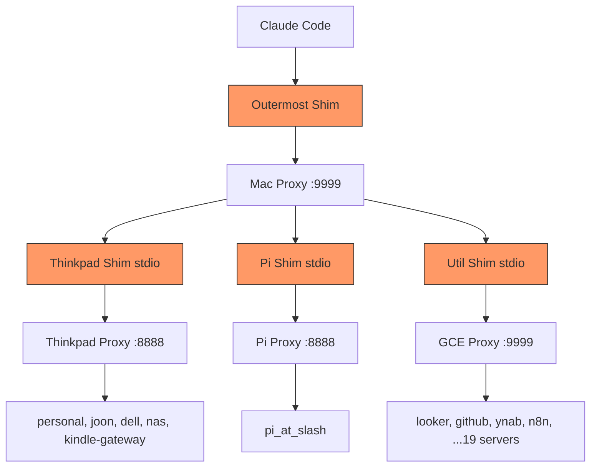

# Work Log

## 1. Current Understanding

<current_mode>
v1.4.1 shipped. proxy_admin tool live across all transport modes. Shim-at-every-edge deployed: Mac proxy wraps thinkpad/pi/util upstreams in stdio shims. Recursive fleet tree + nested path routing verified in production.
</current_mode>

<active_task>
</active_task>

<parked_tasks>
- Pi /mcp/all/ endpoint returns 0 tools — workaround: use /mcp/ instead. Root cause TBD.
- CLAUDE.md blip recovery procedure (pointer to manage-mcp-proxy skill)
- Dockerfile update for daemon mode
</parked_tasks>

<vision>
MCP proxy shim as the universal agent-friendly interface layer for mcpproxy-go. Every proxy-to-proxy boundary gets a shim ("shim-at-every-edge"), making proxy_admin available at every level through standard MCP tooling. Agents self-heal blips without curl/run_command.
</vision>

<decisions>
DECISION-001: No caching in describe_tools — always query live BM25 (owner requirement).
DECISION-002: Re-serialize args via JSON.stringify(JSON.parse()) instead of passthrough — prevents Go unmarshal failures from non-canonical LLM escaping.
DECISION-003: Reject invalid args with clear error instead of silent fallback to "{}" — never silently drop data.
DECISION-004: Daemon mode is independent of core.ts — pure MCP SDK passthrough, no mcpproxy-go dependency.
DECISION-005: daemon_help built-in tool + server instructions in initialize response — clients know how to use the gateway immediately.
DECISION-006: proxy_admin derives admin URL from MCP_URL (same origin, /api/v1/ path). API key from ?apikey= param or defaults to "admin".
DECISION-007: Shim-at-every-edge: push shim to CLIENT side (Mac proxy config), not server side. Zero changes needed on proxy hosts. Hot-reloadable via config.
DECISION-008: Nested proxy_admin discovery uses retrieve_tools BM25 (server attribution) not tools/list (deduplicates). Route via call_tool_read (server:tool format).
DECISION-009: Path notation ("thinkpad/personal") for nested restart — / separator is safe because mcpproxy-go server names are [a-zA-Z0-9_-].
</decisions>

<blockers>
Pi /mcp/all/ endpoint: returns 0 tools via shim but 9 tools via direct HTTP. Same mcpproxy-go v0.23.1 as thinkpad (which works fine). Workaround: use /mcp/ instead of /mcp/all/.
</blockers>

<next_action>
Debug Pi /mcp/all/ issue. Update CLAUDE.md blip recovery note + manage-mcp-proxy skill docs.
</next_action>

---

## 2. Key Events

| Date | Event | Impact |
|------|-------|--------|
| 2026-03-25 | Issue #1 filed: describe_tools name resolution + args_json serialization errors | Two bugs from heavy multi-agent session (~15 subagents, ~80+ proxy calls) |
| 2026-03-25 | LOG-001: Issue #1 fixes — BM25 query improvements + ensureJsonObjectString | describe_tools always queries live BM25 with raw name + transformed queries. args re-serialized to canonical JSON. |
| 2026-03-25 | LOG-002: Transcript analysis — identified re-serialization as key fix for args_json | LLM intermittently sends args as pre-serialized string. Raw string passthrough caused Go unmarshal failures. |
| 2026-03-25 | LOG-003: Daemon mode implemented | Multi-server MCP gateway: stdio + HTTP upstreams, pure passthrough, tool namespacing, custom headers |
| 2026-03-26 | LOG-004: daemon_help tool + server instructions + README update | Clients get full usage guide via built-in tool and MCP instructions |
| 2026-03-26 | LOG-005: Strict args validation — reject instead of silent fallback | ArgsValidationError with descriptive messages. Schema description updated. |
| 2026-04-11 | LOG-006: proxy_admin tool — proxy lifecycle management + shim-at-every-edge | Agents self-heal blips via MCP tools. Recursive fleet tree. Nested path routing. v1.4.0→v1.4.1. |

---

## 3. Atomic Session Log

### [LOG-001] - [BUG] [EXEC] - Issue #1: describe_tools + args_json fixes - Task: TASK-001
**Timestamp:** 2026-03-25 22:00
**Depends On:** Issue #1 report

---

#### Discovery

Reproduced against live wmcpproxy upstream with multi-filesystem mounts. Both issues from Issue #1 analyzed:

1. **describe_tools**: BM25 search-only approach failed for certain tool name patterns. Fixed by adding raw tool name as BM25 query (most targeted) alongside transformed queries.

2. **args_json**: LLM intermittently sends `args` as pre-serialized JSON string instead of native object. The raw string could have non-canonical escaping that Go's `json.Unmarshal` rejects. Fixed by always re-serializing via `JSON.stringify(JSON.parse(input))`.

#### Evidence

Transcript from production session showed:
- LOG-030 heredoc append: `args: "{\"command\": \"cd ..."` (string, not object) → `Invalid args_json format`
- GitHub issue_write: `args: "{\"method\": \"create\", ..."` (string) → same error
- Both succeeded on retry when LLM sent `args` as native object

---

STATELESS HANDOFF
**What was decided:** Always query live BM25 (no caching). Re-serialize args to canonical JSON. Add raw tool name as BM25 query.
**Next action:** Strict validation (LOG-005).

### [LOG-002] - [EXEC] - Daemon mode implementation - Task: TASK-002
**Timestamp:** 2026-03-25 23:30
**Depends On:** LOG-001

---

#### Implementation

New `daemon` subcommand in `src/daemon.ts`:
- Connects to N upstream MCP servers (stdio spawn or HTTP Streamable)
- Aggregates all tools with `serverName__toolName` namespacing
- Pure passthrough — no schema transformation
- Custom HTTP headers per upstream (Authorization, API keys, etc.)
- HTTPS proxy support via undici ProxyAgent
- Health endpoint with per-server status

Tested against wmcpproxy upstream via HTTP Streamable transport. 10 tools aggregated, tool calls passthrough correctly.

---

STATELESS HANDOFF
**What was decided:** Daemon is independent of core.ts. Tool namespacing with double underscore. daemon_help built-in tool.
**Next action:** README docs + helper tool.

### [LOG-003] - [EXEC] - Strict args validation - Task: TASK-001
**Timestamp:** 2026-03-26 00:30
**Depends On:** LOG-001

---

#### Changes

Replaced silent `"{}"` fallback with `ArgsValidationError` that rejects immediately with descriptive error messages. Updated schema description to tell clients exactly what `args` expects.

Tested all scenarios:
- Native object ✅, valid JSON string ✅, null ✅
- Boolean ❌ rejected, string primitive ❌ rejected, bad JSON ❌ rejected, array ❌ rejected
- Nested JSON strings inside object ✅ (works fine)

---

📦 STATELESS HANDOFF
**What was decided:** Never silently drop data. Reject with clear error that tells client how to fix.
**Next action:** Write GSD-Lite artifacts, merge branch.

### [LOG-006] - [DISCOVERY] [EXEC] - proxy_admin tool + shim-at-every-edge architecture - Task: TASK-003
**Timestamp:** 2026-04-11 10:00
**Depends On:** LOG-001 (core.ts foundation), LOG-002 (daemon mode)

---

#### Problem

When upstream MCP servers blip (transient disconnect), agents waste 4-5 tool calls fumbling:
1. Try tool → "not found"
2. Try run_command → also not found
3. Search servers → wrong params
4. upstream_servers list → no restart operation
5. Eventually tools come back on their own (~30s)

The agent couldn't actively trigger a reconnect because:
- `upstream_servers` meta tool has no `restart` operation (only list/add/remove/patch/tail_log)
- Admin API requires curl + knowing the proxy port — different per session type
- Three session types (CLI, Desktop, Cloud) each connect to different proxies

#### Architecture: Shim-at-Every-Edge

Key insight: the shim (`@luutuankiet/mcp-proxy-shim`) is the universal constant across all session types. Every session flows through it. So we add admin capabilities TO the shim.



Client-side deployment: shims run as stdio processes on the Mac, not on server hosts. Zero changes to existing systemd services. Hot-reloadable via proxy config.

#### Implementation (P0-P3)

**P0 — Core (core.ts, daemon.ts):**
- `getAdminBaseUrl()`: derives admin API URL from MCP_URL. `http://localhost:9999/mcp/?apikey=admin` → `http://localhost:9999/api/v1/`
- `adminRequest(method, path)`: HTTP calls to admin API with X-API-Key header
- `PROXY_ADMIN_SCHEMA`: shim-local tool with operations: list, restart, reconnect, tail_log
- `handleProxyAdminOperation()`: shared handler for MCP tool + daemon REST
- Daemon's `/call` catches `name === "proxy_admin"` before upstream forwarding

**P2 — Path routing:**
- `server_name: "thinkpad/personal"` splits on `/`, discovers thinkpad's proxy_admin via retrieve_tools, routes through `call_tool_read`

**P3 — Recursive list:**
- `recursive: true` walks all shim-wrapped upstreams, calls their proxy_admin, merges into tree

#### Discovery Bug (v1.4.0 → v1.4.1)

Original `discoverNestedProxyAdmin` scanned `cachedTools` (from `tools/list`) for tools ending with `__proxy_admin`. But shim-wrapped upstreams expose `proxy_admin` (no prefix). When 3 upstreams all have `proxy_admin`, `tools/list` deduplicates — losing server attribution.

**Fix:** Use `retrieve_tools` (BM25) which returns `server` field. Match `tool.name === "proxy_admin" && tool.server === serverName`. Route via `call_tool_read` with `server:proxy_admin` format for disambiguation.

#### Evidence

**Recursive list output (production, v1.4.1):**
```
Mac proxy (outermost)
├─ pi (12 tools) [shim-wrapped]
│   └─ pi_at_slash (9 tools)
├─ thinkpad (60 tools) [shim-wrapped]
│   ├─ personal (9), joon (9), dell (9), nas (9), thinkpad_host (9)
│   └─ kindle-gateway (13 tools)
├─ util (230 tools) [shim-wrapped]
│   ├─ looker-da (62), ynab (44), github (41), n8n (24), freshrss (18)
│   └─ ...19 servers total
└─ mac (disabled)
```

**Path routing test:**
```
proxy_admin({operation: "restart", server_name: "thinkpad/dell"})  
→ {success: true, data: {server: "dell", action: "restart", success: true}}
```

Chain: Mac shim → Mac proxy → call_tool_read → thinkpad shim → thinkpad:8888 admin API → dell restarted.

#### Known Issue: Pi /mcp/all/

Pi proxy v0.23.1 returns 0 tools via `/mcp/all/` but works via `/mcp/`. Same mcpproxy version as thinkpad (works fine). Workaround: Pi shim uses `/mcp/` instead of `/mcp/all/`. Root cause TBD.

#### Files Changed

| File | Lines | Summary |
|------|-------|--------|
| src/core.ts | +263 (v1.4.0), +50/-22 (v1.4.1) | Admin helpers, proxy_admin schema/handler, discovery fix |
| src/daemon.ts | +16 | Import handleProxyAdminOperation, catch in /call handler |
| test/daemon-e2e.mjs | +109 | Mock admin API + 6 proxy_admin test cases (31/31 pass) |
| package.json | version bump | 1.3.5 → 1.4.0 → 1.4.1 |

---

📦 STATELESS HANDOFF
**Dependency chain:** LOG-006 ← LOG-001 (core.ts), LOG-002 (daemon)
**What was decided:** proxy_admin tool exposes admin API through standard MCP tooling. Shim-at-every-edge: client-side stdio shims wrap each proxy upstream. BM25 discovery + call_tool_read routing for nested chains.
**Next action:** Debug Pi /mcp/all/ issue. Update CLAUDE.md blip note + manage-mcp-proxy skill docs.
**If pivoting:** Start from LOG-006 + fleet tree output above for full architecture context.
