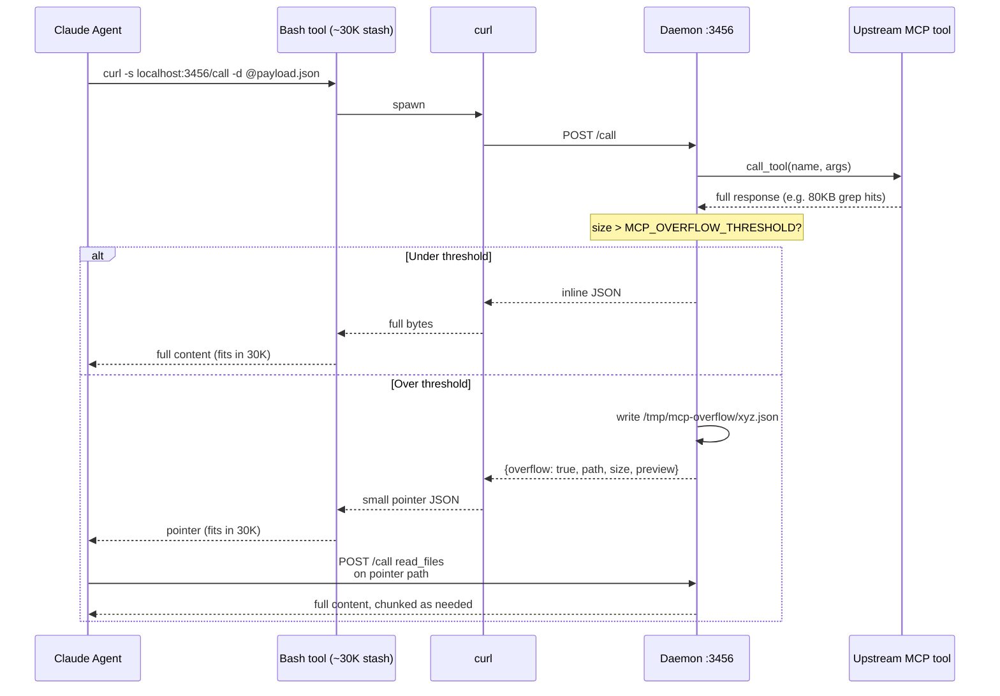

# v1.5.0 — Overflow-to-File Bypass for Daemon REST Mode

**Released:** 2026-04-11
**Type:** Feature (backward-compatible)
**Audience:** Anyone running `mcp-proxy-shim daemon` inside Claude Code sandbox sessions

---

## TL;DR

Claude Code truncates any `Bash` tool response larger than ~30,000 characters. The daemon's REST mode returns unwrapped MCP content as JSON over curl — which is a `Bash` tool call. Large tool responses (grep hits, bulk reads, artifact fetches) were silently chopped off mid-JSON, corrupting everything downstream.

v1.5.0 detects oversize responses on the daemon side and spills them to a tmpfile **before** they hit the Bash stash. The agent gets back a small pointer JSON with the file path. It then reads the file normally — no truncation, no silent corruption, no guessing what the tail of the response was supposed to be.

This is the release that makes daemon mode actually usable for real work in cloud/sandbox sessions where native MCP isn't available.

---

## Why This Release Exists

We hit this wall while running GSD-Lite sessions on a cloud box that doesn't have native `mcp__proxy__*` tools. The fallback is daemon mode: a local HTTP bridge on `:3456` that you talk to via curl. It works great — until you `grep_content` across a codebase and the response is 80KB.

What we observed:

1. The upstream MCP tool runs fine and returns the full payload.
2. The daemon unwraps it and hands it back as an HTTP response — also fine.
3. `curl -s localhost:3456/call ...` receives the full bytes — fine.
4. Claude Code's `Bash` tool receives curl's stdout, sees it's >30K chars, and **lops off the tail**.
5. The agent parses what looks like valid JSON (the cut usually lands mid-string), misses half the results, and proceeds confidently in the wrong direction.

The upstream tracking issue is [anthropics/claude-code#42869](https://github.com/anthropics/claude-code/issues/42869). Until that gets a platform fix, the shim works around it.

---

## Highlights

| Change | What it does | Why it matters |
|---|---|---|
| **Overflow detection** | Daemon measures serialized response size before returning | Catches the problem at the source instead of hoping downstream clients are kind |
| **Tmpfile spillover** | Responses > threshold are written to `/tmp/mcp-overflow/<uuid>.json` | Disk is cheap; 30K stash is not |
| **Pointer response** | Agent receives `{"overflow": true, "path": "...", "size": N, "preview": "..."}` | Small pointer fits in 30K easily; preview gives context |
| **Configurable threshold** | `MCP_OVERFLOW_THRESHOLD` env var (default: 25000) | Tune down if your harness is stricter, tune up if you're on a bigger stash |
| **Backward compatible** | Responses under threshold return inline as before | Zero migration cost for callers already on v1.4.x |

---

## How It Works



---

## Before / After

### Before (v1.4.1)

```bash
# Agent fires a big grep
curl -s localhost:3456/call -d @/tmp/mcp-edits/grep.json
```

Response on the wire: 82KB of JSON with 340 matches.

What the agent actually sees: the first ~29,500 characters, then `...[response truncated]`. The JSON is invalid. The agent tries to parse it, fails, re-runs the grep with a narrower pattern, misses the match it was looking for, and concludes the file doesn't contain the string.

**Net result:** wrong answer, confidently delivered. No error visible to the user.

### After (v1.5.0)

```bash
# Same call, same payload
curl -s localhost:3456/call -d @/tmp/mcp-edits/grep.json
```

Response:

```json
{
  "overflow": true,
  "path": "/tmp/mcp-overflow/a3f9c1.json",
  "size": 82447,
  "preview": "{\"matches\":[{\"file\":\"src/server.ts\",\"line\":42,...",
  "reason": "response exceeds MCP_OVERFLOW_THRESHOLD (25000)"
}
```

Agent sees the pointer, recognizes the `overflow: true` flag, and reads the tmpfile with the standard `read_files` tool (which supports head/tail/line-range, so chunking is free). Full 340 matches available, zero guesswork.

**Net result:** correct answer, agent didn't have to invent a workaround.

---

## Configuration

| Env var | Default | Purpose |
|---|---|---|
| `MCP_OVERFLOW_THRESHOLD` | `25000` | Response size (bytes) above which spillover kicks in |
| `MCP_OVERFLOW_DIR` | `/tmp/mcp-overflow` | Where spill files land |
| `MCP_OVERFLOW_TTL` | `3600` | Seconds before a spill file is cleaned up (on next daemon tick) |

No new flags, no config file changes. Existing daemon deployments upgrade cleanly with `npm update -g @luutuankiet/mcp-proxy-shim`.

---

## Upgrade Notes

- **No breaking changes.** Under-threshold responses still return inline. If you were happy on v1.4.x, you're happy on v1.5.0 with zero config changes.
- **Disk usage.** Spill dir defaults to `/tmp` which is usually tmpfs. On very busy sessions you may see ~50MB transient. Auto-cleanup on TTL.
- **Security.** Spill files are written with mode `0600` and randomized UUID names. They're local to the daemon host, same trust boundary as the daemon itself.
- **Observability.** Overflow events are logged to `/tmp/mcp-daemon.log` with the upstream tool name and response size — useful for profiling which tools are spilly.

---

## Files Changed

- `src/daemon/server.ts` — overflow detection in `/call` handler
- `src/daemon/overflow.ts` — new module: spill + cleanup
- `README.md` — daemon section updated with overflow behavior
- `test/overflow.test.ts` — new tests covering threshold, preview truncation, cleanup

See full diff: [`v1.4.1...v1.5.0`](https://github.com/luutuankiet/mcp-proxy-shim/compare/v1.4.1...v1.5.0)

---

## The Hard Truth

This release is a workaround for a platform constraint, not a feature we wanted to build. The right fix lives in Claude Code's Bash tool stash handling. Until that ships, the shim will keep bridging the gap — and as we discovered writing these notes, "readable release notes six months from now" is worth the upfront cost every time.

Thanks to everyone who got corrupted-JSON nightmares on cloud sessions before this landed.
