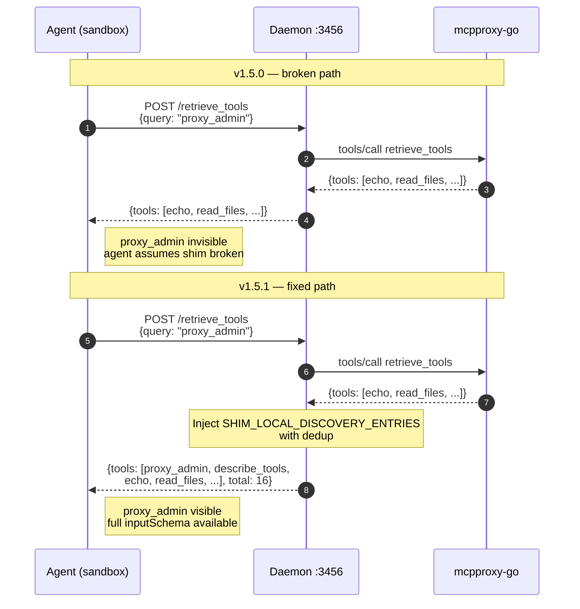

# v1.5.1 — Shim-Local Tools Now Discoverable via Daemon REST

**Released:** 2026-04-11
**Type:** Bug fix (backward-compatible)
**Audience:** Anyone running `mcp-proxy-shim daemon` and relying on `/retrieve_tools` or `/describe_tools` to surface the shim's built-in management tools

---

## TL;DR

The shim ships with two built-in tools that exist only at the shim layer — `proxy_admin` (for restart/reconnect/tail_log/list of upstream MCP servers) and `describe_tools` (for hydrating compacted tool schemas). They worked fine over the native `/mcp` endpoint because `createShimServer` registers them unconditionally in its `ListToolsRequestSchema` handler.

But the **daemon REST discovery endpoints** — `POST /retrieve_tools` and `POST /describe_tools` — only queried upstream mcpproxy-go. Upstream has no idea those tools exist. So agents running in sandbox/daemon mode couldn't discover them, and calling them worked only if you already knew the exact name by heart.

v1.5.1 injects the shim-local tools into both discovery paths. Agents in daemon mode can now `retrieve_tools("proxy_admin")` and get back a real result with a full `inputSchema`.

This is also the first release to exercise **Pattern C** (per-file narrative release notes consumed by `gh release create --notes-file`) end-to-end. The workflow fails loudly if `releases/v1.5.1.md` is missing — you're reading the artifact that proves it didn't.

---

## Why This Release Exists

During an autonomous handoff session on 2026-04-11, we tried to discover `proxy_admin` from a sandbox-cc session running in daemon mode. The query came up empty:

```
curl -s localhost:3456/retrieve_tools -d '{"query":"proxy_admin"}'
→ {"tools": [...only upstream tools...], "total": 14}
```

The tool was alive and callable (`POST /call` with the exact name worked), but invisible to discovery. This is a silent trap: a fresh agent reading the onboarding docs can't find the tools the docs reference. They conclude the shim is broken or the daemon is misconfigured. Both wrong.

Root cause (logged as **LOG-007 BUG 2** in `gsd-lite/WORK.md`):

- `daemon.ts::handleRetrieveTools` — calls `mcpRequest("tools/call", { name: "retrieve_tools", arguments: body })` and returns the result verbatim. Upstream's BM25 index doesn't contain `proxy_admin` because that tool never traverses the upstream boundary.
- `daemon.ts::handleDescribeTools` — same story. It seeds an index `Map` from upstream queries, so shim-local names never get a match and come back with `{error: "not found"}`.

Meanwhile `core.ts::createShimServer` correctly handles this for the native MCP path — the `ListToolsRequestSchema` handler always prepends `DESCRIBE_TOOLS_SCHEMA` and `PROXY_ADMIN_SCHEMA`. Two code paths, two behaviors. That's the bug.

---

## Highlights

| Change | What it does | Why it matters |
|---|---|---|
| **Shim-local injection in `/retrieve_tools`** | `handleRetrieveTools` always prepends `proxy_admin` + `describe_tools` to the `tools` array (with dedup) and bumps `total` | Agents discover shim-local tools by function keyword, not memorized name |
| **Shim-local seeding in `/describe_tools`** | `handleDescribeTools` seeds its resolution index with shim-local tools **before** querying upstream | Schema hydration returns real `inputSchema` instead of `{error: "not found"}` |
| **Unconditional registration** | Matches `core.ts::createShimServer` — same tools, same source of truth, same visibility on both MCP and REST paths | Path parity: no more "works on /mcp, broken on /retrieve_tools" asymmetry |
| **`server: "shim-local"` wrapper** | Both entries carry a synthetic server id so the agent can distinguish them from upstream tools | Clean mental model: shim tools aren't pretending to come from upstream |
| **`call_with` field set correctly** | `proxy_admin → call_tool_destructive`, `describe_tools → call_tool_read` | Agents know which daemon method to use without trial-and-error |
| **--help lists built-in tools** | `mcp-proxy-shim daemon --help` now documents `proxy_admin` and `describe_tools` | Discoverability via CLI as well as API |

---

## How It Works



---

## Before / After

**Before (v1.5.0):**

```bash
$ curl -s localhost:3456/retrieve_tools -d '{"query":"proxy_admin"}' | jq '.tools | map(.name)'
[
  "echo_tool",
  "read_files",
  "grep_content"
]
# proxy_admin missing — agent gives up, reaches for bash/systemctl instead
```

**After (v1.5.1):**

```bash
$ curl -s localhost:3456/retrieve_tools -d '{"query":"proxy_admin"}' | jq '.tools | map(.name)'
[
  "proxy_admin",
  "describe_tools",
  "echo_tool",
  "read_files",
  "grep_content"
]

$ curl -s localhost:3456/describe_tools -d '{"names":["proxy_admin"]}' | jq '.[0].inputSchema.properties.operation'
{
  "type": "string",
  "enum": ["list", "restart", "reconnect", "tail_log"],
  "description": "Management operation to perform"
}
# agent now knows exactly what to pass
```

---

## Configuration

No new env vars. No schema changes. No CLI flag changes (beyond the --help text update).

---

## Upgrade Notes

- **Fully backward-compatible.** Existing agents calling `/call` with `name: "proxy_admin"` continue to work exactly as before.
- **No breaking changes to the response shape.** `tools[]` gains two entries and `total` increments accordingly — any consumer iterating the array will see the new entries, any consumer filtering by server id will need to know `"shim-local"` is a valid origin.
- **Dedup is safe.** If upstream ever adds a tool named `proxy_admin` or `describe_tools` (don't), the existing upstream entry wins and the injection is skipped.

---

## Verification

12 new assertions added to `test/daemon-e2e.mjs`:

- `POST /retrieve_tools {query: "proxy_admin"}` → contains `proxy_admin` + `describe_tools` with correct `server` and `call_with` fields
- `POST /describe_tools {names: ["proxy_admin", "describe_tools"]}` → both resolve without error, both carry `inputSchema.properties` for their key fields (`operation`, `names`)

Full suite: **43 passed, 0 failed.**

---

## Files Changed

- `src/core.ts` — export `DESCRIBE_TOOLS_SCHEMA` + `PROXY_ADMIN_SCHEMA` so the daemon can import them
- `src/daemon.ts` — add `SHIM_LOCAL_DISCOVERY_ENTRIES` constant, inject into `handleRetrieveTools`, seed `handleDescribeTools` index
- `src/index.ts` — document built-in tools in `daemon --help`
- `test/daemon-e2e.mjs` — 2 new test blocks covering both discovery paths
- `package.json` — 1.5.0 → 1.5.1
- `releases/v1.5.1.md` — this file

**Full Changelog:** https://github.com/luutuankiet/mcp-proxy-shim/compare/v1.5.0...v1.5.1

---

## Acknowledgment

This release double-purposes as the **first end-to-end exercise of Pattern C** (per-file narrative release notes). The publish workflow was migrated to `--notes-file` in v1.5.0's follow-up, but v1.5.0 shipped via the legacy categorized-commits path so the new workflow was never actually exercised in anger. v1.5.1 is the first tag that flows through:

1. `releases/v1.5.1.md` must exist (this file)
2. Workflow reads it verbatim via `gh release create --title v1.5.1 --notes-file releases/v1.5.1.md`
3. GitHub Release body matches the file byte-for-byte
4. OIDC publish to npm succeeds with provenance

If you're reading this on github.com/luutuankiet/mcp-proxy-shim/releases/tag/v1.5.1, all four gates passed. If Pattern C is broken, the release would never have published and you'd be reading v1.5.0.
