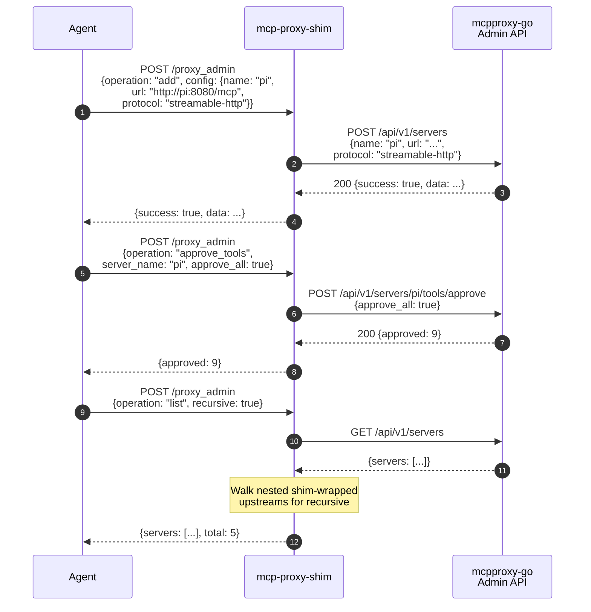

# v1.6.0 — proxy_admin Becomes a Full Fleet Management Tool

**Released:** 2026-04-12
**Type:** Feature (backward-compatible)
**Audience:** Anyone managing upstream mcpproxy-go instances via the shim — especially agents in daemon/sandbox mode

---

## TL;DR

proxy_admin shipped in v1.4.0 with four operations: list, restart, reconnect, tail_log. Enough to recover from blips, not enough to *manage* a proxy fleet. Meanwhile, mcpproxy-go's admin API has ~70 routes covering server lifecycle, quarantine workflows, tool approval, config inspection, and search.

v1.6.0 closes the gap: **16 operations** (12 new), a **first-class REST endpoint** (`POST /proxy_admin`), and a **schema discovery endpoint** (`GET /proxy_admin/schema`). An agent can now add servers, remove them, enable/disable, quarantine/unquarantine, approve tools, inspect config, search the tool index, and check status — all through the same proxy_admin tool that already handles restart and reconnect.

The hardcoded schema that caused a production bug (wrong field name `mode` vs. the correct `protocol`) is replaced with an expanded, accurate schema covering all mcpproxy-go AddServerRequest fields.

---

## Why This Release Exists

Two problems surfaced in production:

**1. Schema drift caused a silent failure.** An agent tried to add an HTTP upstream via `proxy_admin add` with `mode: "streamable-http"`. The call failed because the upstream field is `protocol`, not `mode`. Both `"http"` and `"streamable-http"` are valid values — the enum was fine, the *field name* was wrong. A hardcoded schema written by a human reading Go source code got the name wrong, and there was no way for the agent to catch it.

**2. The shim only exposed 4 of ~70 admin operations.** Agents that needed to add a server, approve quarantined tools, or inspect config had to fall back to raw `curl` via `run_command` — defeating the purpose of having a managed tool interface.

---

## Highlights

| Change | What it does | Why it matters |
|---|---|---|
| **12 new operations** | add, remove, patch, enable, disable, quarantine, unquarantine, approve_tools, inspect_config, inspect_server, search_tools, status | Agents manage full server lifecycle without leaving MCP |
| **`POST /proxy_admin` endpoint** | First-class REST path — no more burying calls under `/call` | Consistent with `/retrieve_tools`, `/describe_tools`, `/reinit` |
| **`GET /proxy_admin/schema`** | Returns live inputSchema for proxy_admin | Agents can introspect available operations at runtime |
| **Correct field names** | `protocol` (not `mode`), with valid values: stdio, http, streamable-http, sse, auto | Closes the production schema-drift bug |
| **`config` parameter** | Structured object for add/patch with all AddServerRequest fields | Agents get autocomplete on server config fields |
| **`approve_tools` with tools array or approve_all** | Matches upstream `POST /api/v1/servers/{id}/tools/approve` | Quarantine workflow fully manageable via MCP |
| **`inspect_server` composite** | Fetches server config + health + tools in one call | Single-tool introspection without multiple API round-trips |
| **89 E2E tests** (was 43) | 46 new assertions covering all new operations + REST endpoints | Every operation tested against mock admin API |

---

## How It Works



---

## Before / After

**Before (v1.5.1) — agent needs to add a server:**

```bash
# Agent falls back to raw curl because proxy_admin only has 4 ops
curl -X POST localhost:8080/api/v1/servers \
  -H "X-API-Key: admin" \
  -d '{"name":"pi","url":"http://pi:8080/mcp","mode":"streamable-http"}'
#                                                  ^^^^ WRONG FIELD NAME
# 400 Bad Request — agent doesn't know why, retries with same wrong field
```

**After (v1.6.0) — same task through proxy_admin:**

```bash
curl -X POST localhost:3456/proxy_admin -d '{
  "operation": "add",
  "config": {"name":"pi","url":"http://pi:8080/mcp","protocol":"streamable-http"}
}'
# 200 OK — correct field name, correct enum, first try
```

---

## All 16 Operations

| Operation | Required params | Route hit | Notes |
|---|---|---|---|
| `list` | — | `GET /api/v1/servers` | `recursive: true` walks nested shims |
| `restart` | `server_name` | `POST /servers/{id}/restart` | Path notation for nested: `"thinkpad/pi"` |
| `reconnect` | — | `POST /servers/reconnect` | Reconnects ALL servers |
| `tail_log` | `server_name` | `GET /servers/{id}/logs?tail=N` | Pagination, not streaming |
| `add` | `config.name` | `POST /servers` | Full AddServerRequest schema |
| `remove` | `server_name` | `DELETE /servers/{id}` | |
| `patch` | `server_name`, `config` | `PATCH /servers/{id}` | Partial update — only non-nil fields applied |
| `enable` | `server_name` | `POST /servers/{id}/enable` | |
| `disable` | `server_name` | `POST /servers/{id}/disable` | |
| `quarantine` | `server_name` | `POST /servers/{id}/quarantine` | |
| `unquarantine` | `server_name` | `POST /servers/{id}/unquarantine` | |
| `approve_tools` | `server_name` + (`tools[]` or `approve_all`) | `POST /servers/{id}/tools/approve` | |
| `inspect_config` | — | `GET /config` | Full proxy config + path |
| `inspect_server` | `server_name` | `GET /servers` + `GET /servers/{id}/tools` | Composite: config + health + tools |
| `search_tools` | `query` | `GET /index/search?q=...` | BM25 search, `limit` param |
| `status` | — | `GET /status` | Running state, routing mode |

---

## Configuration

No new env vars. No breaking changes. The existing `proxy_admin` tool gains new operations and parameters — all additive.

New REST endpoints on the daemon:
- `POST /proxy_admin` — first-class fleet management (same args as the MCP tool)
- `GET /proxy_admin/schema` — returns the tool's inputSchema for runtime introspection

---

## Upgrade Notes

- **Fully backward-compatible.** Existing calls with `operation: "list"`, `"restart"`, `"reconnect"`, `"tail_log"` work identically.
- **New `config` parameter** for `add`/`patch` operations — an object matching mcpproxy-go's `AddServerRequest` struct.
- **`protocol` field** (not `mode`) with values: `stdio`, `http`, `streamable-http`, `sse`, `auto`. `http` and `streamable-http` are runtime aliases in mcpproxy-go.
- **Quarantine is on by default** in mcpproxy-go — servers added via `add` will be quarantined unless `config.quarantined: false` is explicitly passed.

---

## Verification

46 new test assertions added to `test/daemon-e2e.mjs`:

- All 12 new operations tested via `POST /call` path
- `POST /proxy_admin` first-class endpoint tested (add operation)
- `GET /proxy_admin/schema` tested (returns 16-operation enum, has all expected properties)
- Error cases: missing required params return 400

Full suite: **89 passed, 0 failed** (up from 43 in v1.5.1).

---

## Files Changed

- `src/core.ts` — expanded `PROXY_ADMIN_SCHEMA` (4→16 ops), added `body` param to `adminRequest`, added 12 new operation handlers, expanded options type
- `src/daemon.ts` — added `handleProxyAdminRest`, `POST /proxy_admin` + `GET /proxy_admin/schema` routes
- `src/index.ts` — updated `--help` with new operations and endpoints
- `test/daemon-e2e.mjs` — 13 new mock admin API routes + 46 new test assertions
- `package.json` — 1.5.1 → 1.6.0
- `releases/v1.6.0.md` — this file

**Full Changelog:** https://github.com/luutuankiet/mcp-proxy-shim/compare/v1.5.1...v1.6.0
