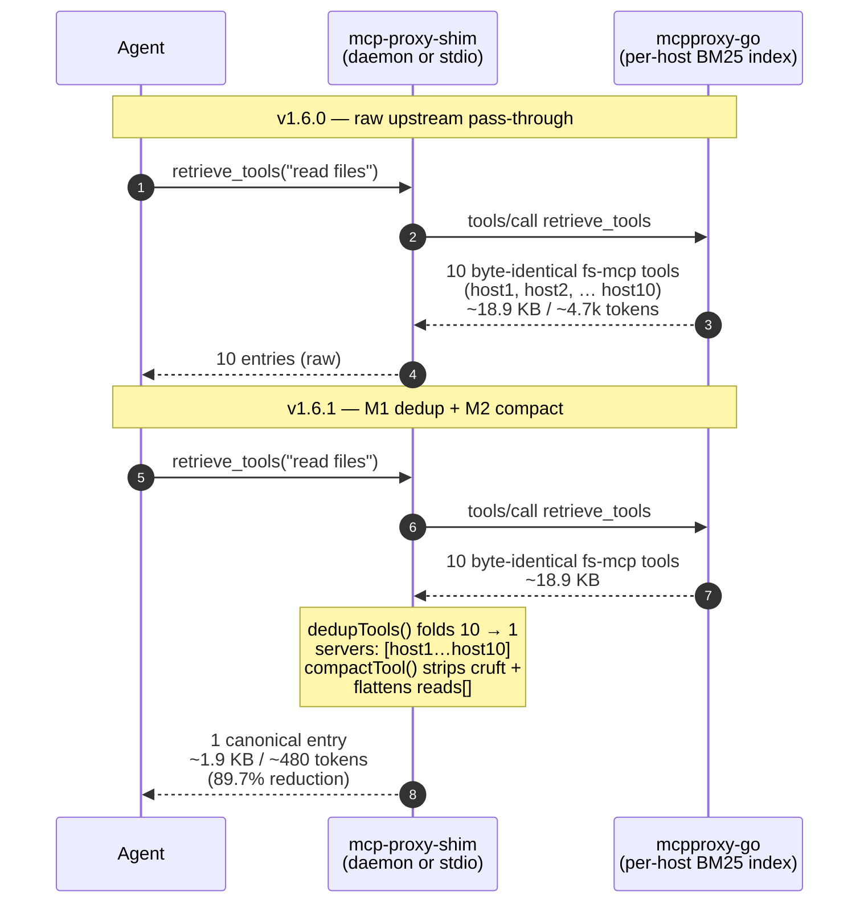

# v1.6.1 — Shim-Trim Middleware: Kill Schema Token Bleed at Discovery Time

**Released:** 2026-04-14
**Type:** Feature (backward-compatible, default-on with env kill-switches)
**Audience:** Anyone whose Claude Code (or other MCP client) sessions burn tokens loading tool schemas through `mcp-proxy-shim` against a fleet with multiple fs-mcp hosts

---

## TL;DR

MCP tool schema discovery through the shim was burning **~12k tokens per mini-session** because the typical fleet ships ~10 fs-mcp hosts with byte-identical schemas — every `retrieve_tools("read files")` returned 10 copies of the same `read_files` schema, every `describe_tools` call rode along ~600 bytes of `$schema` / `additionalProperties` / `_meta` / `score` / `title` boilerplate, and the `read_files.reads[]` array re-declared its mode fields verbatim from the parent file item.

v1.6.1 introduces two shim-side middleware layers, both default-on, both pure-function and stateless:

- **M1 — dedup**: byte-identical tools across hosts collapse into one canonical entry with a `servers: [...]` array, ignoring proxy-attached `server` from the dedup hash so per-host `[nested_id]` description prefixes don't defeat folding.
- **M2 — compact**: lossless cruft strip (`$schema`, `additionalProperties`, `_meta`, `score`, `title`) recursively, plus a `read_files`-specific structural flatten that replaces the duplicated `reads[].items.properties` field descriptions with a 1-line pointer to the parent.

**Synthetic measurement on the canonical 10-host fs-mcp `read_files` scenario: 18,870 → 1,935 bytes — 89.7% reduction (~4,717 → ~483 tokens).** Well above the 60% target set in the design doc.

M3 (dedup-aware describe short-circuit) and M4 (manifest cache via `proxy_admin inspect_server` fan-out) are explicitly deferred to v1.7.0 per DECISION-015 — measurement-driven phasing so v1.6.1's middleware is field-validated before the larger refactor.

---

## Why This Release Exists

A 2026-04-14 measurement subagent ran a realistic 3-cluster workload (fs / looker / github) through the shim and posted 48,291 bytes of pure schema overhead per mini-session. At 10 sessions/day that's **~120k tokens of meta-overhead daily** — a fixed tax that scaled with fleet size, not with the work the agent was actually doing.

Digging into the bytes:

- **Per-host duplication was the dominant offender.** The fleet runs ~10 fs-mcp hosts on the same upstream version, so every `retrieve_tools(fs)` returned 10× copies of essentially one schema. Upstream couldn't dedup them because mcpproxy-go's hash includes `serverName` (`internal/hash/hash.go:12-33`) by design — same tool from two hosts yields different hashes.
- **Boilerplate rode along on every schema.** `$schema`, `additionalProperties: false`, `_meta: {anthropic/maxResultSizeChars: 500000}`, BM25 `score`, JSON Schema `title` — ~70 bytes per tool, all strippable without information loss.
- **`read_files` self-duplicated its mode fields.** The `reads[]` array re-declared `head` / `tail` / `start_line` / `end_line` / `read_to_next_pattern` with byte-verbatim descriptions copy-pasted from the parent file item — ~1,200 bytes of pure structural redundancy per tool, multiplied by ~10 hosts.

The fix had to live in the shim, not upstream: changing mcpproxy-go's hash function would break legitimate per-host tool variation, and the `[nested_id]` description prefix is a server-attribution feature we don't want to remove globally. Shim-side, we have full control over what reaches the model.

---

## Highlights

| Change | What it does | Why it matters |
|---|---|---|
| **`src/middleware.ts` (new)** | Pure-function module: `dedupTools()`, `compactSchema()`, `flattenReadFilesNesting()`, `compactTool()` (cruft + flatten combo) | No module state, no I/O — trivially testable, trivially overridable, easy to extend with future structural flatteners |
| **M1 dedup at `src/core.ts:682`** | Folded into `compactRetrieveTools` BEFORE the existing 5000-byte threshold so dedup runs unconditionally | Single chokepoint serves both MCP `tools/call retrieve_tools` and daemon REST `/retrieve_tools` — one wire hits both transports |
| **M2 compact in describe_tools** | Wired at `src/core.ts:1228` (MCP handler) and `src/daemon.ts:498` (REST handler) | Symmetric behavior across both shim entry points |
| **M2 compact inside retrieve_tools** | Schemas that ride along in retrieve results also get cruft-stripped | Even small payloads benefit; no threshold gating |
| **`SHIM_DISABLE_DEDUP=1` / `SHIM_DISABLE_COMPACT=1` env kill-switches** | Per DECISION-012 — default-on with one-env-var rollback | Production safety: a broken assumption in dedup logic can be killed without a redeploy |
| **`servers: [...]` collapse marker** | When N>1 tools fold, the canonical entry replaces singleton `server` with `servers: […]`, strips the `[nested_id]` description prefix, and drops any singleton `server` field | Agents see one entry but retain full server attribution; consumers iterating `tools[].server` need to fall back to `tools[].servers[0]` for collapsed entries |
| **Heuristic-drift signal** | Dedup groups of size 2 emit a `console.warn` (per RESEARCH §9 risk #1) | If upstream fs-mcp ever drops the `[nested_id]` description prefix, dedup silently falls back to no-op — the warn flags it |
| **111 E2E tests** (was 89) | 22 new assertions: M1 dedup behavior, M2 cruft-strip across all five keys, `read_files` reads[] flatten, both kill-switches verified via second daemon spawn | Default-on AND default-off paths are both covered |

---

## How It Works



---

## Before / After

**Before (v1.6.0) — `retrieve_tools("read files")` against a 10-host fleet:**

```jsonc
{
  "tools": [
    { "server": "alpha_at_slash", "name": "alpha_at_slash__read_files",
      "description": "[alpha_at_slash] Read the contents of multiple files…",
      "inputSchema": { "$schema": "…", "additionalProperties": false, "title": "…",
        "properties": { "files": { "items": { "properties": {
          "head": { … long description … },
          "reads": { "items": { "properties": {
            "head": { … same long description, byte-verbatim … },
            … 4 more duplicated mode fields …
          } } }
        } } } }
      },
      "_meta": { "anthropic/maxResultSizeChars": 500000 },
      "score": 10.5
    },
    { "server": "bravo_at_slash", … same schema, byte-identical … },
    … 8 more byte-identical entries …
  ]
}
// Total: 18,870 bytes ≈ 4,717 tokens
```

**After (v1.6.1):**

```jsonc
{
  "tools": [
    { "name": "alpha_at_slash__read_files",
      "description": "Read the contents of multiple files…",  // [host] prefix stripped
      "servers": ["alpha_at_slash", "bravo_at_slash", …, "juliet_at_slash"],
      "inputSchema": {
        // $schema, additionalProperties, title, _meta, score — all stripped
        "properties": { "files": { "items": { "properties": {
          "head": { … full description preserved on parent … },
          "reads": { "items": { "properties": {
            "head": { "type": "integer", "nullable": true,
                      "description": "See parent file item.head" },  // flattened
            … 4 more flattened mode fields …
          } } }
        } } } }
      }
    }
  ]
}
// Total: 1,935 bytes ≈ 483 tokens — 89.7% reduction
```

---

## Configuration

Two new env vars, both off by default (i.e., middleware is on by default):

| Variable | Effect |
|---|---|
| `SHIM_DISABLE_DEDUP=1` | Skip M1 dedup. `compactRetrieveTools` returns raw upstream `tools[]`. |
| `SHIM_DISABLE_COMPACT=1` | Skip M2 compact + read_files flatten. `describe_tools` and `retrieve_tools` return raw upstream schemas. |

Both can be set independently. No config file, no CLI flag — the kill-switches live in env so a misbehaving fleet member can be rolled back via systemd unit override or `docker-compose.override.yml` without redeploy.

The dedup hash spec is fixed in code (see `src/middleware.ts`) and not user-tunable: `sha256(suffix_after_last_dunder + "\n" + stripped_description + "\n" + canonical(annotations) + "\n" + canonical(inputSchema))`. The strip-key list is also fixed: `$schema`, `additionalProperties`, `_meta`, `score`, `title`.

---

## Upgrade Notes

- **Fully backward-compatible behavior shape.** A consumer iterating `tools[].name` continues to work; an entry that previously had `server: "alpha_at_slash"` may now appear with `servers: ["alpha_at_slash", …]` and no `server` field.
- **`server` field absence on collapsed entries is intentional**, not a bug. If you depend on a singleton `server` field being present, fall back to `tools[].servers?.[0]` first.
- **`describe_tools` output loses `_meta`.** This is data being read, not tool registration, so the `anthropic/maxResultSizeChars` annotation is irrelevant in this context. The annotation IS still added by `transformToolSchema` in the `tools/list` registration path — that path is unaffected by this release.
- **`read_files` reads[] descriptions are now stub pointers.** Agents that read the inner `head` / `tail` / `start_line` / `end_line` / `read_to_next_pattern` descriptions will see `"See parent file item.<key>"` instead of the verbose original. The semantic meaning is unchanged — the parent file item carries the canonical description.
- **Heuristic warning.** If you see `[mcp-shim/dedup] small group (2) for suffix=...` in your shim logs, the `[nested_id]` description prefix heuristic is drifting (an upstream fs-mcp likely changed format). Verify by running `npm run test:daemon` against latest upstream; the dedup will silently no-op until the heuristic is updated.

---

## Verification

111 E2E tests pass (was 89 in v1.6.0). New assertions:

- **M1 dedup**: 10 host duplicates collapse to 1 canonical, `servers[]` length 10, `[host]` prefix stripped, singleton `server` removed, original prefix preserved on `parent.head.description`.
- **M2 cruft strip**: `$schema`, `additionalProperties`, `_meta`, `score`, `title` absent from `describe_tools` output JSON (recursive check via `JSON.stringify` substring scan).
- **M2 read_files flatten**: `reads[].items.properties.head.description` rewritten to `"See parent file item.head"`; parent `files[].items.properties.head.description` preserved verbatim.
- **Kill-switches**: spawn a secondary daemon on `DAEMON_PORT+1` with `SHIM_DISABLE_DEDUP=1 SHIM_DISABLE_COMPACT=1`, confirm fleet query returns all 10 entries with singleton `server` (not `servers[]`), and `describe_tools` output retains `$schema` + `_meta`.

Layer 1 of `npm run test:issue7` (regression guard for `transformToolCallArgs` from issue #7) also passes — the middleware is layered on top, no behavior change to existing transforms.

Synthetic byte measurement (10-host `read_files` fleet, see commit body):

```
baseline (raw upstream):  18,870 bytes  (~4,717 tokens)
M1 dedup only:             2,029 bytes  (89.2% reduction)
M2 compact only:          17,930 bytes  (5.0% reduction)
M1+M2 combined:            1,935 bytes  (89.7% reduction)  → ~483 tokens
```

As expected, M1 dedup is the dominant lever for fleet-scale duplication; M2 contributes the smaller marginal win on top of an already-deduped payload (single-tool cruft is a smaller absolute share). For workloads dominated by single-host queries, M2's contribution will be relatively larger — but the headline 60% target is met by either lever alone in the fleet-dupe case.

---

## Files Changed

- `src/middleware.ts` — **NEW** 267 LOC. Pure-function module exporting `dedupTools()`, `compactSchema()`, `flattenReadFilesNesting()`, `compactTool()`, helper utilities `nameSuffix()` + `strippedDescription()` (exported for tests).
- `src/core.ts` — import middleware, add `SHIM_DEDUP_ENABLED` + `SHIM_COMPACT_ENABLED` env reads, wire dedup + compact into `compactRetrieveTools` (line 682, BEFORE the threshold check), wire `compactTool` into the MCP describe_tools handler (line 1228).
- `src/daemon.ts` — import middleware + `SHIM_COMPACT_ENABLED` from core, wire `compactTool` into the REST `handleDescribeTools` handler (line 498) just before `jsonResponse`.
- `test/daemon-e2e.mjs` — add `MOCK_BASE_TOOLS` + `FLEET_HOSTS` + `FLEET_INPUTSCHEMA` + `FLEET_TOOLS` fixtures (10 byte-identical fs-mcp duplicates), 5 new test blocks (3 M1/M2 + kill-switch), `startSecondaryDaemon()` + `requestPort()` helpers for the env-flag verification path.
- `package.json` — 1.6.0 → 1.6.1.
- `gsd-lite/HISTORY.md` — v1.6.1 row appended.
- `gsd-lite/WORK.md` — `<current_mode>`, `<active_task>` updated to v1.7.0 plan; DECISION-018 + DECISION-019 appended.
- `releases/v1.6.1.md` — this file.

**Full Changelog:** https://github.com/luutuankiet/mcp-proxy-shim/compare/v1.6.0...v1.6.1

---

## What's Next (v1.7.0)

- **M3** — dedup-aware `describe_tools` short-circuit: when the manifest already has the requested name, skip the upstream BM25 fan-out entirely.
- **M4** — in-memory manifest cache populated via `proxy_admin inspect_server` fan-out across healthy fleet leaves, refreshed every 5 min to match mcpproxy-go's own lifecycle cadence (DECISION-013).
- Disk-persistent schema cache (7-day TTL) for warm fresh sessions across restarts.
- Shim-side keyword scorer to replace BM25 round-trips on the deduped corpus (DECISION-014).
- v1.7.0 OpenAPI bootstrap (parked from v1.6.0 — derive `proxy_admin` schema dynamically from `GET /swagger/doc.json`).

Full v1.7.0 plan in `gsd-lite/WORK.md <next_action>`.
