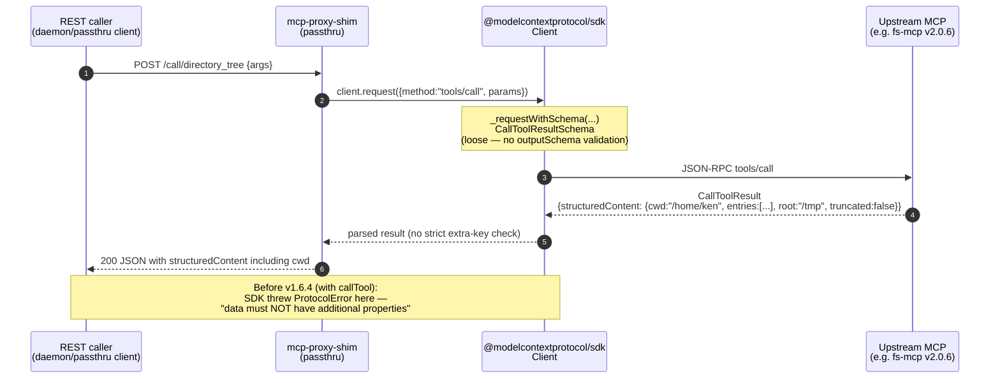

# v1.6.4 — Passthru: `Protocol.request()` replaces `Client.callTool()`, skips strict tool-output-schema validation

**Released:** 2026-04-20
**Type:** Bug fix (behavior change — loosens response validation on tool calls)
**Audience:** Anyone proxying an MCP server that decorates tool responses with extra top-level keys in `structuredContent` (fs-mcp injects `cwd`; similar patterns elsewhere)

---

## TL;DR

The shim rejected every tool call from fs-mcp v2.0.0+ with `MCP error -32602: Structured content does not match the tool's output schema: data must NOT have additional properties`. Root cause: `Client.callTool()` in `@modelcontextprotocol/sdk` runs a strict `outputSchema` validator against `structuredContent` that fails whenever the upstream adds keys the schema doesn't declare. fs-mcp's v2.0.0 result decorator injects `cwd` as a model-visible hint — legitimate feature, failing downstream validator.

Fix: switch the stdio path from `client.callTool()` to the low-level `client.request({method: "tools/call", ...})`. Same JSON-RPC round trip, same base `CallToolResultSchema` shape check, but skips the extra `structuredContent`-vs-`outputSchema` validation that `callTool()` layers on top. This matches the shim's stated role as a passthrough — schema enforcement belongs to the final consumer, not the proxy.

One line changed in `src/passthru.ts`. No API surface change for daemon/passthru callers.

---

## Why This Release Exists

fs-mcp v2.0.0 (2026-04-19) introduced a `resultDecorator` (`internal/server/server.go:37`) that adds two pieces of metadata to every `CallToolResult`:

1. `_meta.anthropic/maxResultSizeChars = 500000` — a client hint at the result level (legal per MCP spec, no validation impact).
2. **`structuredContent.cwd = "<portal root>"`** — injected via `injectCwd()` so the model always sees what directory its relative paths resolve against, regardless of which tool it just called.

The `cwd` injection was reasonable server-side design — it's cross-cutting context the model should always have. But the shim's SDK client validated every tool result against the tool's advertised `outputSchema`, and since `directory_tree`'s schema (for example) declares only `root`, `entries`, `truncated` with the go-sdk default strict `additionalProperties: false`, the injected `cwd` failed validation. The response never reached the caller — instead they got the `-32602` error.

Reproducible steps with any fs-mcp v2.0.x through shim v1.6.3:

```bash
MCP_PORT=7890 npx -y @luutuankiet/mcp-proxy-shim@1.6.3 passthru \
  -- /usr/local/bin/fs-mcp -skip-bootstrap -skip-update &

curl -s -X POST localhost:7890/call/directory_tree \
  -H 'content-type: application/json' \
  --data-raw '{"args":{"path":"/tmp","max_depth":1}}'

# → {"error":"Tool call failed",
#    "detail":"MCP error -32602: Structured content does not match the tool's output schema: data must NOT have additional properties"}
```

The production fleet didn't hit this because `mcpproxy-go` (the fleet proxy) doesn't validate upstream tool results — it just forwards. The shim was stricter-by-accident via SDK default. Either the shim matches mcpproxy-go (lenient passthrough) or every server that decorates has to file a PR against the shim. Lenient wins — the shim's job description explicitly says "proxy", not "validator".

---

## Highlights

| Change | What it does | Why it matters |
|---|---|---|
| **`src/passthru.ts:647` swap** | `client.callTool({name, arguments})` → `client.request({method: "tools/call", params: {name, arguments}})` | Same protocol flow, skips `callTool`'s `getToolOutputValidator(name)` path at `client.ts:893` that calls `validator(structuredContent)` |
| **Base shape check preserved** | `_requestWithSchema` still validates against `CallToolResultSchema` | Garbage responses still fail loudly — the shim isn't accepting anything; just not enforcing per-tool strict output schemas |
| **Zero API surface change** | `/call/<tool>` REST endpoint and MCP stdio responses look identical on the wire | Downstream consumers (daemon REST clients, stdio passthru clients) see no behavioral difference on valid responses; previously-broken servers now work |
| **Matches HTTP transport behavior** | HTTP path already uses `rawMcpRequest` (`src/passthru.ts:628-644`) which bypasses the SDK client entirely due to a separate SDK bug (#396); stdio now has equivalent passthrough semantics | No more transport-dependent validation — stdio and HTTP agree |

---

## How It Works



---

## Before / After

| Scenario | v1.6.3 and earlier | v1.6.4 |
|---|---|---|
| Upstream strictly compliant (structuredContent matches outputSchema exactly) | ✅ works | ✅ works |
| Upstream decorates structuredContent with extra keys (fs-mcp `cwd`, others) | ❌ `MCP error -32602: data must NOT have additional properties` — response blocked | ✅ full response passes through, extra keys preserved |
| Upstream advertises outputSchema but returns no structuredContent | ❌ SDK throws "Tool X has output schema but did not return structured content" | ⚠️ passes through — server-bug detection is no longer the shim's job. Client should validate if needed. |
| Response completely malformed (missing `content` array, wrong types on base fields) | ❌ rejected by `CallToolResultSchema` | ❌ still rejected by `CallToolResultSchema` — base shape check remains |

Response bytes on the wire are identical between v1.6.3 and v1.6.4 for the strictly-compliant case. The change is only in what the shim *tolerates* from upstream, not in what it emits downstream.

---

## Regression Analysis

`Client.callTool()` does three things on top of `Protocol.request()` (source: `packages/client/src/client/client.ts:870-917` in `@modelcontextprotocol/typescript-sdk`):

1. **Task-required tool guard** (lines 872-877) — throws if the tool requires task-based execution. **Lost in this change.** Consequence: if an upstream exposes a task-required tool through the shim, the agent sees garbled output instead of a clear SDK error. No known fleet server uses task tools today. Easy to add back as a shim-side check if needed.
2. **Missing structuredContent when outputSchema advertised** (lines 885-890) — throws if the upstream forgot to populate structuredContent. **Lost in this change.** Consequence: upstream bugs that would have surfaced as "tool X has schema but no structuredContent" now pass through as responses with missing structured data. This was never the shim's bug to catch — it's the upstream's responsibility.
3. **`structuredContent`-vs-`outputSchema` validation** (lines 893-913) — **the whole point of the fix.** Intentionally skipped.

Preserved: `_requestWithSchema` still validates against `CallToolResultSchema` (which declares `structuredContent: z.record(z.string(), z.unknown()).optional()` in `schemas.ts:1381` — accepts any object, no extra-key rejection). JSON-RPC id tracking, abort signals, timeouts, transport reconnection are all in `Protocol.request` and unaffected.

---

## Upgrade

Drop-in patch. No client-side change needed.

```bash
npm install @luutuankiet/mcp-proxy-shim@1.6.4   # or just @latest
# or, for CLI usage:
npx -y @luutuankiet/mcp-proxy-shim@latest passthru -- <upstream>
```

**Behavioral change to flag:** callers that depended on the shim rejecting non-compliant tool responses will now see those responses pass through. The shim is explicitly stepping back from schema enforcement — if your workflow treats `client.callTool()` as a gate against server bugs, move that gate to the final consumer (Claude Code runs its own validation; bespoke clients should add theirs).

---

## Files changed

- `src/passthru.ts` — one-liner: replace `client.callTool(...)` with `client.request({method: "tools/call", params: {...}})`. Comment block documents the rationale so the next reader doesn't re-add the strict path by accident.
- `package.json` — version bump to 1.6.4.
- `releases/README.md` — index entry.

**Full Changelog**: https://github.com/luutuankiet/mcp-proxy-shim/compare/v1.6.3...v1.6.4
