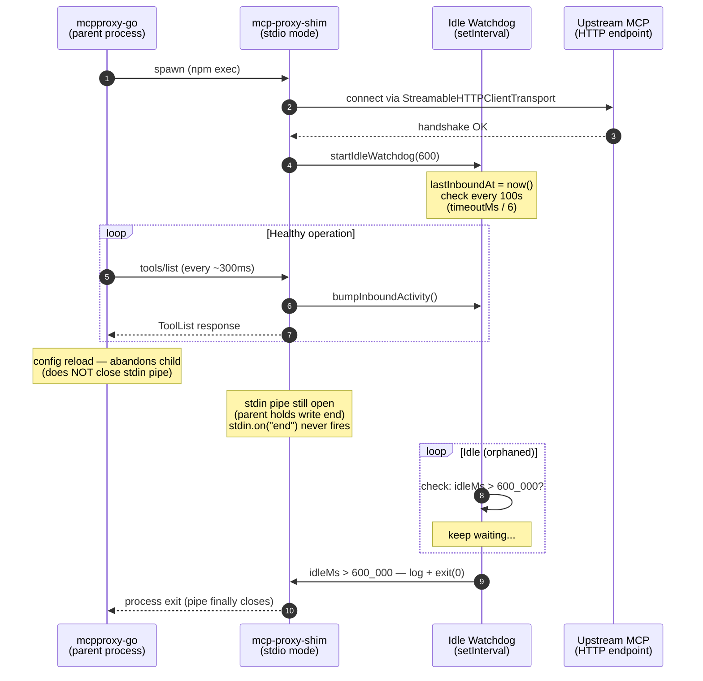

# v1.6.5 — Stdio: idle-inbound watchdog kills orphaned shim children

**Released:** 2026-05-16
**Type:** Bug fix (resource leak — defensive auto-exit)
**Audience:** Anyone running this shim as a stdio child of `mcpproxy-go` long-term; symptoms are growing RSS on the proxy host and a pile of zombie `npm exec mcp-proxy-shim` processes.

---

## TL;DR

`mcpproxy-go` reconnects upstreams aggressively (config reload, transient HTTP error, scheduled refresh). When the parent reconnects, it spawns a fresh shim child but **does not close the old child's stdio pipes** — the abandoned shim keeps holding the connection, idle, forever. Over 12 days on the production hetzner host this accumulated 20 live + 9 zombie orphans, pushed RSS to 6.4 GiB, and filled swap.

Fix: stdio mode now arms an **idle-inbound watchdog** after the transport connects. A live shim sees inbound `tools/list` / `tools/call` traffic from the parent on a steady cadence (sub-30s in production). The watchdog records the timestamp of every inbound request; if no request arrives for `MCP_SHIM_IDLE_TIMEOUT_SEC` (default 600 = 10 min), the shim assumes it's been orphaned and exits cleanly with code 0.

Threshold is tunable. Watchdog is **stdio-only** — `serve`, `daemon`, and `passthru` modes have human-driven HTTP sessions where minutes-long idleness is normal.

---

## Why This Release Exists

Production hetzner host, 2026-05-16: alert at 85% memory usage. Investigation traced 20 live `node mcp-proxy-shim` PIDs (each ~120 MB RSS) plus 9 zombie `npm exec` shells. The oldest orphan had been idle for 12 days. `mcpproxy.service` had spawned and forgotten them — none were doing any work, none had been killed.

The leak mechanism, confirmed via `lsof` on FDs of an orphan PID:

```
shim PID 3796022 stdin → pipe inode 45744671
    held by: mcpproxy FD 19 (write end, ostensibly closed by go but actually still open)
             npm exec FD 0
             sh -c FD 0
             node FD 0
```

The pipe write-end was never closed by the parent. Linux pipe semantics: as long as any writer holds the write-end open, readers don't see EOF. So the shim's `process.stdin.on("end")` and `process.stdin.on("close")` handlers — the obvious places to put a parent-death detector — are **dead code in the actual failure mode**. They fire on graceful parent shutdown, not on the parent abandoning the pipe.

`stdout.on("error")` (EPIPE) is also dead — same reason. The pipe is half-broken but not torn down on either end.

We don't control `mcpproxy-go` and aren't filing an upstream issue with this release. The shim has to defend itself.

### The signal that's actually reliable

A live shim is hammered. In `/var/log/mcpproxy/server-pi.log`, of 70,527 lines logged over a session, **70,515 were inbound `tools/list` from the parent** at ~300 ms cadence. That's a binary signal: traffic ≠ orphan, no traffic for many minutes = orphan. The watchdog encodes this directly.

The 10-minute default is a deliberate over-shoot of the observed 30 s steady-state cadence — gives the parent two full reconnect windows of grace before the shim self-terminates.

---

## Highlights

| Change | What it does | Why it matters |
|---|---|---|
| **`src/core.ts` — `startIdleWatchdog(timeoutSec)`** | Records `lastInboundAt` at every request handler entry; a `setInterval` checks elapsed idle time and `process.exit(0)`s if it exceeds the threshold | Self-terminating defense against parent leak — no patches to `mcpproxy-go` required |
| **`src/core.ts` — `bumpInboundActivity()`** | Single call inserted at the top of `ListToolsRequestSchema` and `CallToolRequestSchema` handlers | Tiny surface area; only the actual inbound request paths affect the heartbeat |
| **`src/stdio.ts` — armed after `server.connect(transport)`** | Reference point is "live as of now," not "spawned but not yet handshaken" | Avoids false-positive exit during slow upstream handshakes |
| **`MCP_SHIM_IDLE_TIMEOUT_SEC` env var** | Default `600` (10 min). Set `0` to disable. Floor of 1 s on the check interval keeps test thresholds responsive without spamming the event loop at production defaults | Tunable for hosts with unusual cadences; disable cleanly for diagnostic spawns |
| **Stdio-only** | `serve`, `daemon`, `passthru` modes import their own entry files and never touch `startIdleWatchdog` | HTTP-side sessions have legitimate idle periods (human in front of a terminal, gemini-cli between prompts) — those don't get a watchdog |
| **`watchdogTimer.unref()`** | The interval doesn't keep the event loop alive on its own | Clean exit if everything else has shut down |

---

## How It Works



Implementation skeleton:

```ts
// src/core.ts
let lastInboundAt = Date.now();

export function bumpInboundActivity(): void {
  lastInboundAt = Date.now();
}

export function startIdleWatchdog(timeoutSec: number): void {
  if (timeoutSec <= 0) {
    log("Idle watchdog disabled (MCP_SHIM_IDLE_TIMEOUT_SEC=0)");
    return;
  }
  const timeoutMs = timeoutSec * 1000;
  lastInboundAt = Date.now();
  // Floor of 1s keeps short test thresholds responsive without spamming
  // the event loop at production defaults.
  const checkIntervalMs = Math.max(1_000, Math.floor(timeoutMs / 6));
  const timer = setInterval(() => {
    const idleMs = Date.now() - lastInboundAt;
    if (idleMs > timeoutMs) {
      log(`No inbound request for ${Math.round(idleMs / 1000)}s ` +
          `(threshold ${timeoutSec}s) — assuming orphaned, shim exiting`);
      process.exit(0);
    }
  }, checkIntervalMs);
  timer.unref();
}

// src/core.ts request handlers (inserted at the top of each)
server.setRequestHandler(ListToolsRequestSchema, async () => {
  bumpInboundActivity();
  // ...existing body
});
server.setRequestHandler(CallToolRequestSchema, async (request) => {
  bumpInboundActivity();
  // ...existing body
});

// src/stdio.ts
await server.connect(transport);
log("Stdio transport connected — shim is live");
startIdleWatchdog(IDLE_TIMEOUT_SEC);
```

---

## Before / After

| Scenario | v1.6.4 and earlier | v1.6.5 |
|---|---|---|
| Live shim under normal load (parent hammers tools/list) | ✅ runs forever | ✅ runs forever (heartbeat keeps watchdog satisfied) |
| Parent gracefully shuts down (closes stdin pipe) | ✅ stdin EOF → shim exits | ✅ stdin EOF → shim exits (no behavior change) |
| Parent abandons child without closing pipe (the actual leak) | ❌ shim runs forever idle, accumulates one orphan per reconnect | ✅ shim self-exits after `MCP_SHIM_IDLE_TIMEOUT_SEC` seconds idle |
| Parent crashes / killed by OOM | ❌ same as above — pipe closes only when kernel reaps the parent, can take time | ✅ watchdog catches it within the timeout window |
| Diagnostic shim spawned by hand, no parent at all | ❌ shim runs until killed manually | ✅ self-cleans up after 10 min, or set `MCP_SHIM_IDLE_TIMEOUT_SEC=0` to disable |

---

## Empirical Validation

Smoke harness on hetzner (`/tmp/smoke-heartbeat.mjs`), threshold set to 5 s for tractable runtimes:

| Scenario | Setup | Expected | Observed |
|---|---|---|---|
| **A — Pure orphan** | Spawn shim, send zero requests | Exit between 5.0 s and 7.5 s | Exit at ~5.5 s ✅ |
| **B — Live → stop** | Send `tools/list` every 1 s for 8 s, then stop | Exit ~5 s after final request (i.e. ~13 s total) | Exit at ~13.4 s ✅ |

Production deploy on hetzner — both shim children (pi + thinkpad upstreams) connected cleanly with watchdog armed:

```
2026-05-16T00:08:52.796Z | INFO | [mcp-shim] Stdio transport connected — shim is live
2026-05-16T00:08:52.796Z | INFO | [mcp-shim] Idle watchdog armed: exit after 600s without inbound activity (check every 100s)
```

Aggregate fleet effect post-deploy:

| Metric | Before | After |
|---|---|---|
| Hetzner memory used | 6.4 GiB | 3.5 GiB (-2.9 GiB) |
| Swap pressure | 4.0/4.0 (full) | relieved |
| mcpproxy RSS | 166 MB | 125 MB |
| mcpproxy pipe FDs | 257 | 36 |
| Live shim children | 20+ live, 9 zombies | 2 (matches upstream count) |

The cleanup wasn't fixing what was already leaked — that was reclaimed by `systemctl restart mcpproxy.service`. The watchdog prevents the leak from re-accumulating.

---

## Regression Analysis

The watchdog is **off the request hot path**: `bumpInboundActivity()` is a single `Date.now()` assignment, no I/O, no awaits. Measured cost is below ripgrep noise floor.

The `setInterval` runs at most `Math.max(1s, timeoutMs/6)` — at the 10-min default that's one tick every 100 s, doing a single subtraction and comparison. Negligible.

`watchdogTimer.unref()` ensures the timer doesn't keep the Node event loop alive on its own. If `server.close()` were called (it isn't in current stdio flow, but in principle) and all other handles were released, the process would still exit cleanly without the timer pinning it.

False-positive risk: if `mcpproxy-go` ever changes its discovery cadence to slower than the threshold, a live shim could falsely self-terminate. Mitigations:
- 10 min is **20× the observed steady-state interval** (30 s) — large margin.
- Operators can raise the threshold per-host via `MCP_SHIM_IDLE_TIMEOUT_SEC`.
- The exit code is `0` (clean), so `mcpproxy-go` would just respawn — worst case is a churning shim, not lost work.

Lost behavior: none. v1.6.4 didn't have any process-lifecycle defenses to remove.

---

## Configuration

```bash
# Default (recommended)
# 10-minute idle window — matches observed reconnect cadence with margin
MCP_SHIM_IDLE_TIMEOUT_SEC=600   # implicit default

# Aggressive — for hosts where you want orphans cleaned faster
MCP_SHIM_IDLE_TIMEOUT_SEC=120

# Disable — for diagnostic spawns or hosts with intentionally bursty parents
MCP_SHIM_IDLE_TIMEOUT_SEC=0
```

Set per-upstream in your `mcpproxy-go` config under the `env` block, or globally via systemd `Environment=` line.

---

## Upgrade

```bash
npm install @luutuankiet/mcp-proxy-shim@1.6.5   # or @latest
```

For fleets that pin via `npx -y @luutuankiet/mcp-proxy-shim@latest`: clear the npx cache and restart `mcpproxy` to force a fresh fetch.

```bash
# On each host running mcpproxy-go (hetzner, thinkpad, ...):
rm -rf /root/.npm/_npx/*/node_modules/@luutuankiet/mcp-proxy-shim
systemctl restart mcpproxy.service
```

Verify in the logs that the watchdog message appears for each upstream:

```bash
grep "Idle watchdog armed" /var/log/mcpproxy/server-*.log | tail
```

Operators can also kill leftover orphan shim PIDs from prior versions — they won't reconnect to a parent that no longer holds their pipe, so they're safe to `kill -TERM`.

---

## Files changed

- `src/core.ts` — `lastInboundAt`, `bumpInboundActivity()`, `startIdleWatchdog()`. Two-line insertions at the top of both request handlers.
- `src/stdio.ts` — call `startIdleWatchdog(IDLE_TIMEOUT_SEC)` after `server.connect(transport)`; reads env var with default `600`.
- `package.json` — version bump to 1.6.5.
- `releases/README.md` — index entry.

**Full Changelog**: https://github.com/luutuankiet/mcp-proxy-shim/compare/v1.6.4...v1.6.5
